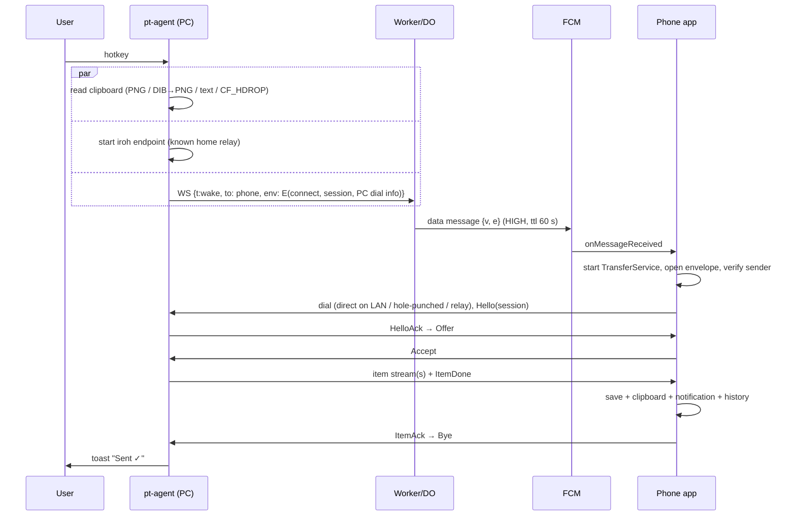
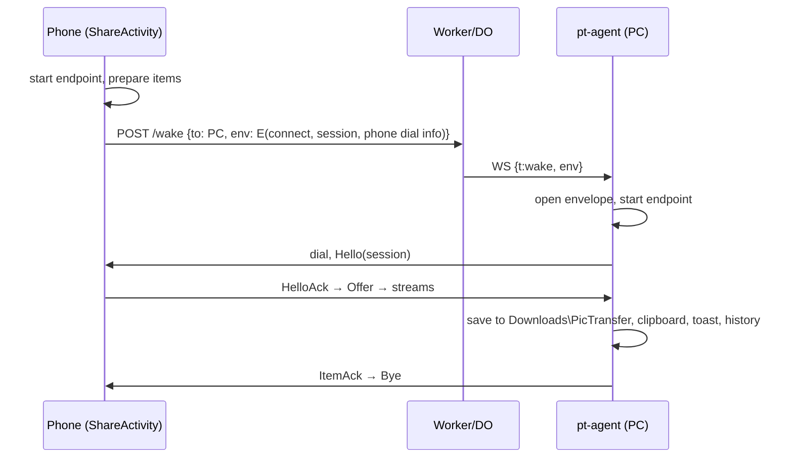

# Architecture

Status: DRAFT (Faz 0). Normative wire details live in [`protocol.md`](protocol.md);
the reasons behind each decision are in [`adr/`](adr/).

## 1. Goals and constraints

- **Core scenario:** copy a screenshot on the PC → press a hotkey → it arrives on
  the phone. No window opens. The target device is chosen in advance. The phone
  shares back to the PC from the system share sheet.
- **Fewest steps:** no account and no password. Pairing is a single QR scan
  (one confirmation on each device).
- **$0 server:** Cloudflare Workers + Durable Objects free tier. Free iroh relays. FCM.
- **Security above market standard:** see [`threat-model.md`](threat-model.md).
- **Windows agent at idle:** < 5 MB RAM, 0 % CPU, < 0.5 MB/day network. This is an
  acceptance gate; see [`resource-budget.md`](resource-budget.md).

## 2. Components

```
 Windows                                   Android
 ───────                                   ───────
 pt-agent.exe (always on, tiny)  ◄═══════► app (no process when idle)
 pt-ui.exe (only while open)     iroh P2P  Rust core + Kotlin/Compose
        │                        E2E + PQ         ▲
        │ one hibernating WS                      │ FCM push
        └──────► Cloudflare Worker + DO ──────────┘
                 (auth · log · presence · wake; never sees content)
```

| Component | Path | Tech | Lifetime | Responsibility |
|---|---|---|---|---|
| Core | `crates/core` (`pt-core`) | Rust | linked into every client | keys and keystore trait; membership log; pairing; iroh endpoint manager; PQ inner layer; transfer engine; history store; server client |
| FFI | `crates/ffi` (`pt-ffi`) | Rust + UniFFI | Android | Kotlin bindings; async functions become `suspend` |
| CLI | `crates/cli` (`ptctl`) | Rust | dev/test | headless peer: pair, send, receive, inspect. Drives E2E tests without phones |
| Windows agent | `apps/windows-agent` (`pt-agent.exe`) | Rust, Win32/WinRT (`windows`, `tray-icon`, `muda`, `global-hotkey`) | always running | tray, hotkey, clipboard, toasts, IPC server, transfers. **No Tauri, no WebView** |
| Windows UI | `apps/windows-ui` (`pt-ui.exe`) | Tauri v2 + React/TypeScript | only while open | pairing QR, devices, settings, history; talks to the agent over a named pipe; exits when closed |
| Android app | `apps/android` | Kotlin, Jetpack Compose, minSdk 29 | woken by FCM or the user | share target, FCM wake handling, foreground transfer service, outputs (gallery, clipboard, notification) |
| Server | `server/` | Cloudflare Worker + SQLite-backed Durable Object, TypeScript | serverless | request auth, log store with compare-and-swap, presence, wake routing (WS → FCM) |

## 3. Windows process model

```
pt-agent.exe  (single instance: named mutex Local\pictransfer-agent-<user SID>)
├─ main thread — Win32 message loop
│   ├─ message-only window: tray icon, WM_HOTKEY, power/network notifications
│   ├─ clipboard read/write, opened on demand
│   └─ COM toast activator (WinRT toast APIs loaded lazily, released after use)
└─ net thread — tokio current_thread runtime
    ├─ server WebSocket (always; app-level keepalive every K s)
    ├─ named-pipe IPC server for pt-ui (\\.\pipe\pictransfer-<SID>, user-only ACL)
    └─ iroh endpoint + transfer tasks — ON DEMAND, closed after 30 s idle
```

- The threads exchange messages over channels. The net thread wakes the main loop
  with `PostMessage`. Neither thread polls.
- `pt-ui.exe` is started from the tray. It keeps no state: it reads from and
  writes to the agent over JSON-RPC on the named pipe. Closing the window ends the
  process, so WebView2 memory returns to the OS.
- Keys, the log, settings and history are owned by the agent (core). The UI never
  touches key material.

## 4. Android structure

| Piece | Role |
|---|---|
| `ShareActivity` (transparent, `excludeFromRecents`) | Receives `ACTION_SEND` / `ACTION_SEND_MULTIPLE` (`*/*`). A Direct Share target sends immediately; otherwise it shows a minimal device picker |
| Sharing shortcuts | One dynamic shortcut per paired PC → appears directly in the system share sheet |
| `PtMessagingService` (FCM) | Receives `{v, e}`; starts `TransferService` within the high-priority exemption |
| `TransferService` (foreground, `dataSync`) | Opens the envelope via core, dials the sender, receives, runs outputs, stops itself |
| Outputs | MediaStore (`Pictures/PicTransfer` for images, `Download/PicTransfer` for other files); clipboard (`ClipData` + FileProvider URI or text); `BigPictureStyle` notification (Share / Open / Copy); history |
| Onboarding | Camera QR scan (CameraX + ZXing), notification permission, guidance to exempt the app from battery optimization (settings intent; no direct-request permission) |
| Keystore bridge | UniFFI callback interface: wrap/unwrap with an Android Keystore AES-GCM key (StrongBox if available) |

When the UI is in the foreground, the app opens the server WebSocket for live
presence and faster wakes. In the background it holds no connection.

## 5. Server structure

- The Worker routes `/v1/groups/{gid}/…` to the Durable Object named `gid`.
  `POST /v1/groups` creates a group from its genesis record.
- One DO per group, SQLite storage: `records`, `devices` (push token, `last_seen`), `meta` (head).
- WebSockets use the Hibernation API. Keepalive uses `setWebSocketAutoResponse("p" → "o")`,
  so idle sockets cost no duration and do not wake the object.
- Secrets (Worker secrets): the FCM service-account key. The FCM OAuth token is cached in DO storage for less than 1 h.
- Rate limits are per device (wakes, appends) and per IP (group creation).

## 6. Key flows

### 6.1 PC → phone (hotkey)



If the phone's UI is open, the DO delivers the wake over the phone's WebSocket
instead of FCM.

### 6.2 Phone → PC (share sheet)



If the PC is offline (`via: "none"`), the phone reports it immediately. A delivery
queue for when the PC comes online again is planned for Faz 2.

### 6.3 Pairing

```mermaid
sequenceDiagram
  participant D as PC (pt-ui → agent)
  participant P as Phone
  participant S as Worker/DO
  D->>D: open pairing window, show QR (eid, dial, secret, exp)
  P->>D: scan QR, dial ALPN pair/1
  P->>D: PairHello(device, proof = HMAC(secret, ekm ‖ eid))
  D->>P: PairInfo(device)
  Note over D,P: both show SAS XXX-XXX + device name; user confirms on both
  D->>S: POST /v1/groups (genesis) — if no group yet
  D->>S: POST …/log add(phone)
  D->>P: PairDone(full log)
  P->>P: validate log, store, register push token
  P->>D: PairOk
```

### 6.4 Removing a device

A member appends `remove(subject)` (§4.4 of the protocol). The DO sends `bye` to
the removed device, deletes its push token and rejects its requests. The appender
wakes the other members with `group-changed`; they sync the log and from then on
reject the removed EndpointId on the transfer ALPN.

## 7. Storage

| Platform | Location | Contents |
|---|---|---|
| Windows | `%LOCALAPPDATA%\pictransfer\keys.bin` | `IK`, `KK`, history key — DPAPI-wrapped (user scope) |
| Windows | `%LOCALAPPDATA%\pictransfer\state.sqlite3` | log, settings, history index (names and text encrypted with the history key); opened on demand and closed when idle |
| Windows | `%LOCALAPPDATA%\pictransfer\logs\` | rotating 3 × 1 MB; ids and error codes only |
| Windows | `%USERPROFILE%\Downloads\PicTransfer\` (configurable) | received files, with Mark-of-the-Web |
| Windows | `%LOCALAPPDATA%\Programs\pictransfer\` | binaries (per-user install, no admin) |
| Windows | HKCU `…\Run`, HKCU `Software\Classes\CLSID\{activator}`, Start Menu shortcut (AUMID + ToastActivatorCLSID) | autostart, toast activation |
| Android | app-private files | `keys.bin` (Keystore-wrapped), `state.sqlite3` |
| Android | MediaStore | received images and files |
| Server (DO) | SQLite | log records, push tokens, `last_seen`, head |

## 8. Settings

| Setting | Default |
|---|---|
| Send hotkey | `Ctrl+Alt+Shift+S` (the recorder warns when Ctrl+Alt+key = AltGr produces a character in the active layout, e.g. TR-Q `@`) |
| Default target | the first paired phone |
| On receive | save ✓ · clipboard ✓ · notification with preview ✓ · history ✓ |
| Save folder (Windows) | `Downloads\PicTransfer` |
| Ask above | 500 MB |
| Relay data | on |
| Start with Windows | on |
| History retention | 30 days or 200 items |
| Reachability (Faz 2) | everywhere (WS) / local network only (no outbound connection while idle) |

## 9. Failure handling

| Situation | Behavior |
|---|---|
| Target offline (`via: none`) | Immediate toast/notification "device is offline" (queue in Faz 2) |
| Wake sent, no dial within 120 s | "Device didn't respond" (likely battery restrictions → link to the guide) |
| Server unreachable | v1: sending fails with a clear message (the wake needs the server); pairing and membership changes need the server too. Faz 2: the LAN fast path works without the server |
| `relay_data` off and no direct path | `DIRECT_UNAVAILABLE` with an explanation |
| Hotkey already taken | Toast + the settings window opens on the hotkey recorder |
| Fork detected | Security alert; transfers blocked until the user re-pairs |

## 10. Observability

No telemetry. Local logs contain ids, timings and error codes only — never
content, names, addresses or keys. `ptctl` and a debug IPC method expose counters
(bytes, connection paths, timings) for spikes and the resource tests.

## 11. Planned extensions

LAN fast path and LAN-only mode; offline queue; resumable transfers and folders;
auto-send of new screenshots (opt-in); cursor device picker; per-device hotkeys;
Android Quick Settings tile; self-hosted relay and server (workerd); UnifiedPush
(F-Droid build); TPM-backed keys and Windows Hello approval for new devices;
macOS/Linux; web client (WASM, relay-only); post-quantum signatures.
